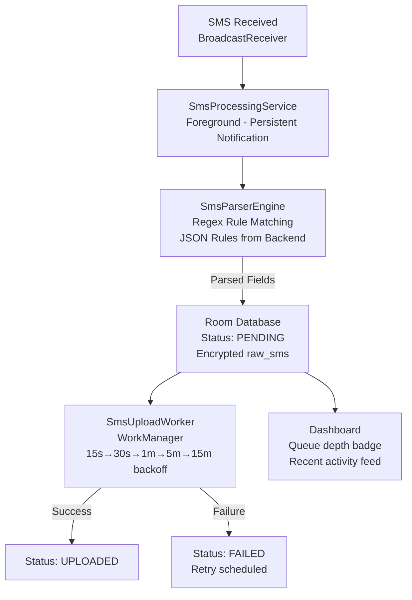
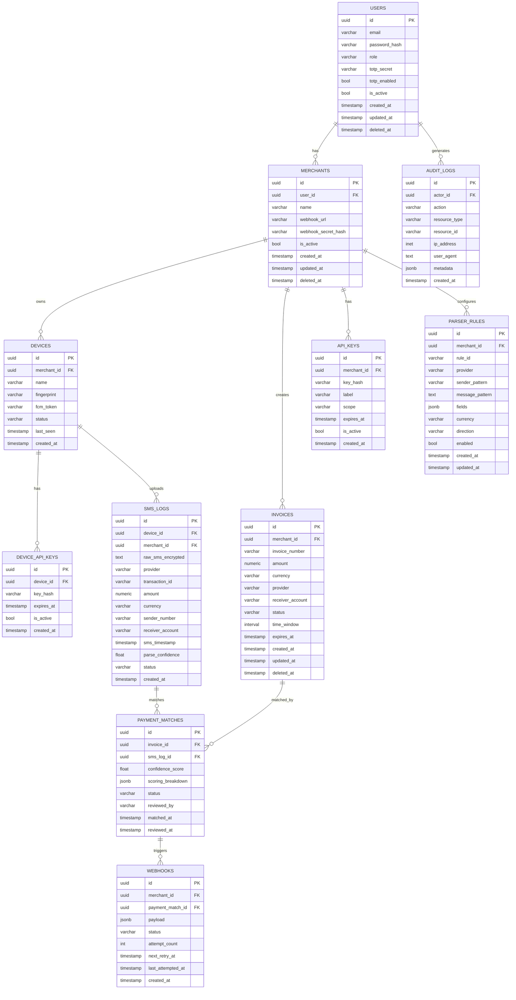
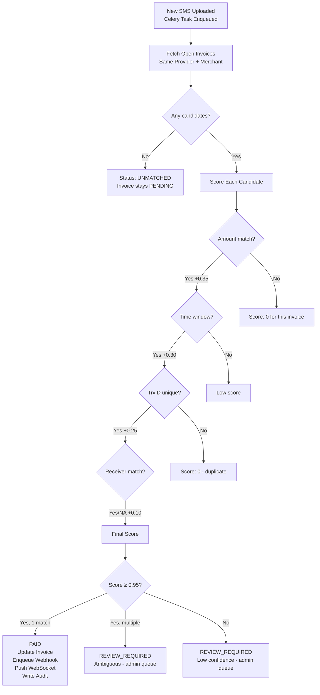
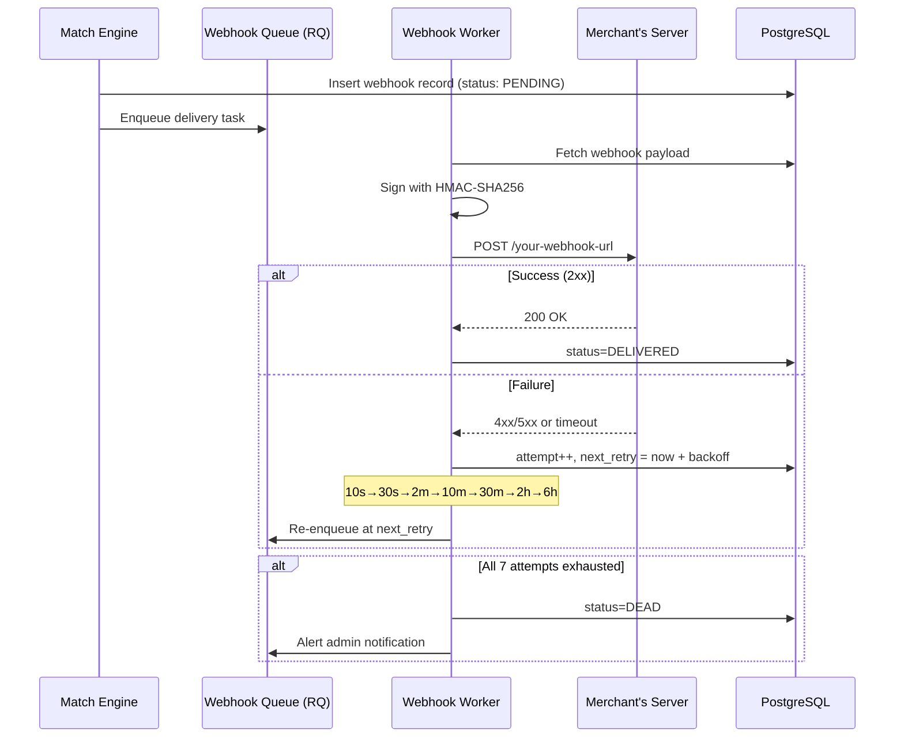

# ShuvoPay — System Design

## System Flow

```mermaid
flowchart TD
    A[Android Device\nSMS BroadcastReceiver] -->|Parse + Encrypt| B[Room DB\nOffline Queue]
    B -->|WorkManager\nExponential Backoff| C[HTTPS + JWT + AES\nX-Device-Key Header\nX-Request-ID Replay Guard]
    C --> D[FastAPI Backend\n/api/v1/sms/report]
    D --> E[Match Engine\nCelery Worker\nAsync Scoring]
    E -->|Invoice Status Update| F[(PostgreSQL\nAES-256 at rest)]
    E -->|Confidence ≥ 0.95| G[WebSocket Push\n/ws/merchant/{id}]
    E -->|HMAC-SHA256 signed| H[Webhook Delivery\nRetry Queue\nRQ Worker]
    G --> I[Merchant Panel\nNext.js - Live Updates]
    H --> J[Merchant's Server\nWebhook Consumer]
    F --> K[Admin Panel\nNext.js - Full Visibility]
    D --> L[Redis\nRate Limit + Replay Cache]
```

## Android Processing Pipeline



## Database ERD



## Match Engine Flow



## Webhook Delivery


